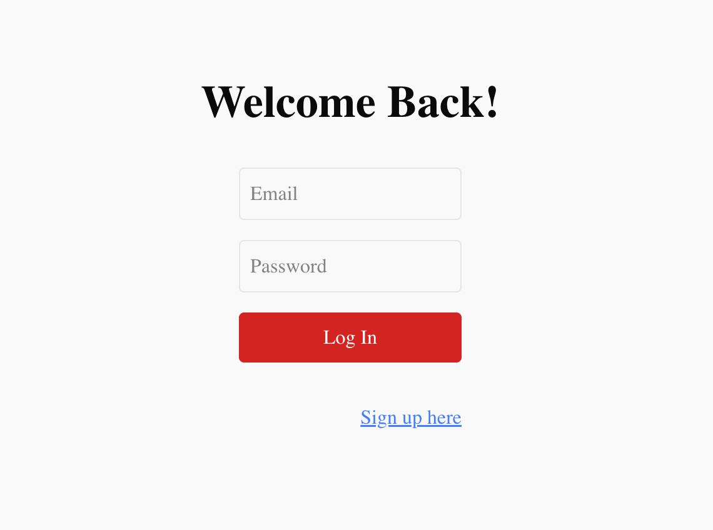
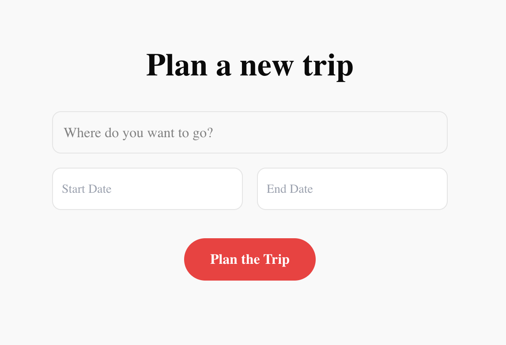
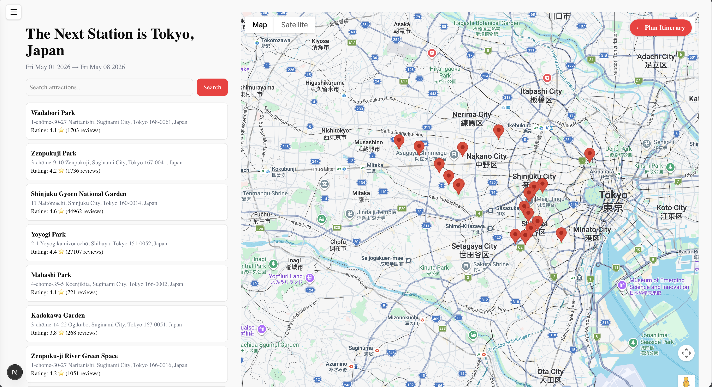
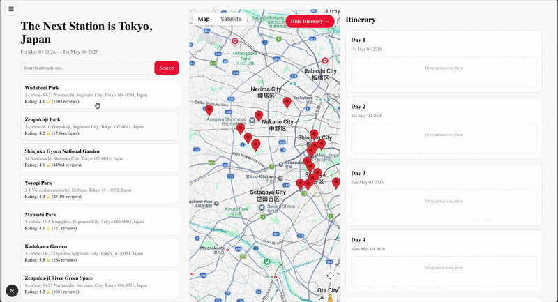
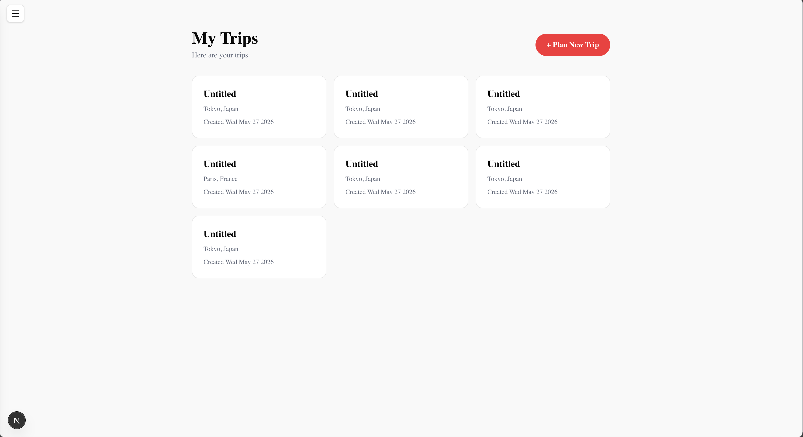
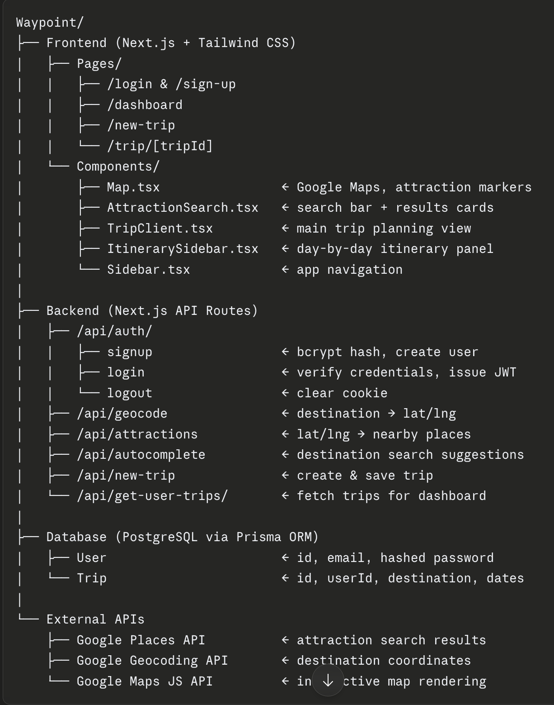

# Waypoint — Intelligent Trip Planning Platform

**Team Name:** Waypoint Wizards
**Team Members:** Li Junyu & Alpha Hong (Team 6761)
**Proposed Level of Achievement:** Apollo

## Motivation

Planning a trip is a complex and time-consuming process. Travelers often need to search across multiple platforms to gather information about attractions, routes, accommodation, weather, and activities. Even after collecting this information, organizing it into a practical day-by-day itinerary requires significant effort.

Existing travel planning tools either focus on specific aspects of travel (such as booking flights or accommodations) or require users to manually construct their itineraries. This fragmented experience makes trip planning inefficient and difficult to manage, particularly for group travel where coordination between multiple people is required.

We are motivated to build a centralized trip planning platform that simplifies this process by automatically organizing travel information and assisting users in generating optimized itineraries. By combining location data, routing information, and personalized preferences, our system aims to help travelers plan trips more efficiently while reducing manual effort.

## Aim

Waypoint is an intelligent trip planning platform that allows users to easily create, manage, and optimize travel itineraries. The system assists users in discovering attractions, organizing daily travel schedules, and optimizing travel routes between locations. By integrating multiple data sources such as location services, weather forecasts, and routing information, the application provides users with a convenient and intelligent way to plan their trips.

The platform also supports collaborative planning so that multiple users can coordinate and contribute to the same itinerary.

## User Stories

1. As a traveler who wants to plan a trip, I want to be able to search for attractions in a destination so that I can build an itinerary for my trip.
2. As someone who dislikes planning, I want the system to automatically generate a suggested itinerary so that I do not need to manually organize all activities.
3. As a traveler planning a group trip, I want to collaborate with my friends on the same itinerary so that everyone can contribute ideas.
4. As a traveler unfamiliar with the city, I want to be able to interact with maps and plan optimised routes between attractions to minimise travel time.
5. As a planner, I want to be able to plan accommodation and bookings on the app.
6. As a traveler, I want to track finances of the trip and record who paid for each expense (Splitwise-style).

## Features

### Core Features

**Feature 1: Intelligent Itinerary Generator**
The system generates a day-by-day itinerary based on user inputs such as destination, trip duration, interests, and preferred activity types. Attractions are selected and organized into a logical schedule.

**Feature 2: Map-Based Route Optimization**
The system calculates optimal routes between attractions using routing APIs to minimize travel time between activities within the same day.

**Feature 3: Attraction Discovery and Search**
Users can search for attractions, restaurants, and points of interest within a destination. Results include location information, ratings, and categories.

### Extension Features

**Feature 4: Collaborative Trip Planning**
Multiple users will be able to edit and contribute to the same itinerary. Users can add, remove, or rearrange activities while updates are synchronized across collaborators.

**Feature 5: Accommodation and Bookings**
The system will integrate third-party accommodation and event booking platforms into the trip planning workflow.

**Feature 6: Budget Estimation and Tracking**
The application will estimate approximate travel costs and feature a built-in shared ledger where trip expenses can be tracked and split between users (similar to Splitwise).

## Milestone 1 — Technical Proof of Concept

### What We Built

For Milestone 1, we have built an integrated frontend and backend that demonstrates the core system architecture with the following working features:

#### 1. User Authentication (Login / Sign Up)
- Users can register a new account and log in via a JWT-based authentication system.
- Passwords are hashed using `bcrypt` before being stored in the database.
- Auth tokens are stored as `httpOnly` cookies for security.
- Backend API routes: `POST /api/auth/signup`, `POST /api/auth/login`, `POST /api/auth/logout`
- Frontend pages: `/login`, `/sign-up`

<table>
  <tr>
    <td></td>
    <td></td>
  </tr>
</table>

#### 2. Trip Creation
- Authenticated users can create a new trip by specifying a destination, start date, and end date.
- The trip is saved to the database and linked to the user's account.
- Users are redirected to the trip planning view upon creation.
- Backend API route: `POST /api/new-trip`
  

  

#### 3. Attraction Search with Google Places API
- Given a destination, the system geocodes the location and fetches nearby attractions using the Google Places Text Search API.
- Results display each attraction's name, rating, address, and total reviews.
- Backend API routes: `GET /api/geocode`, `GET /api/attractions`

#### 4. Interactive Map
- Attractions are displayed as markers on an interactive Google Map (`@vis.gl/react-google-maps`).
- Clicking a marker on the map scrolls to the corresponding attraction card in the list.
- Selecting an attraction card pans the map to its coordinates.

  

#### 5. Drag-and-Drop Itinerary Builder
- Users can drag attractions from the search results panel and drop them into a day-by-day itinerary sidebar.
- Within each day, attractions can be reordered via drag-and-drop using `@dnd-kit`.
- The itinerary sidebar supports multiple days based on the trip duration.

  

#### 6. User Dashboard
- Authenticated users have a dashboard displaying their saved trips.
- Backend API route: `GET /api/get-user-trips/[userId]`

  

### System Architecture

The application follows a layered architecture:

**Key design decisions:**
- Next.js App Router is used for both frontend pages and backend API routes, keeping the codebase unified.
- Prisma ORM abstracts the database layer, making it easy to switch databases if needed.
- Authentication is stateless (JWT) to support future collaborative features.

### Tech Stack

| Layer | Technology |
|---|---|
| Frontend | Next.js 14, React, Tailwind CSS |
| Backend | Next.js API Routes (Node.js) |
| Database | PostgreSQL (via Prisma ORM) |
| Auth | JWT, bcrypt |
| Maps | Google Maps API (`@vis.gl/react-google-maps`) |
| Places | Google Places Text Search API |
| Drag & Drop | `@dnd-kit/core`, `@dnd-kit/sortable` |
| Deployment | To be configured (Docker / Railway) |

### Software Engineering Practices

**Modular Architecture**
The codebase is organized by concern: API routes under `src/app/api/`, React components under `src/components/` (further split by feature: `login/`, `map/`, `trip/`, `itinerary/`, `sidebar/`), and pages under `src/app/`.

**Version Control**
We use Git for version control with our repository hosted on GitHub. Feature branches are used to isolate development work.

**Agile Development**
Development follows an iterative process with weekly goals aligned to milestone targets.

**Testing**
Unit and integration testing will be added progressively, with priority on API routes and core business logic.

## Development Plan

### Milestone 2 (1 Jun – 27 Jul) — Prototype

- Multi-day itinerary generator
- Route optimization between attractions using map APIs
- Users can save, edit, and organize itinerary items persistently
- Database storing full trip plans and attraction information

### Milestone 3 (27 Jul – 26 Aug) — Extended System

- Collaborative trip planning (real-time multi-user editing)
- Weather-based itinerary adjustments
- Budget estimation and shared expense tracking
- Improved UI/UX and performance optimizations
- Cloud deployment (Docker + Railway/Render)
