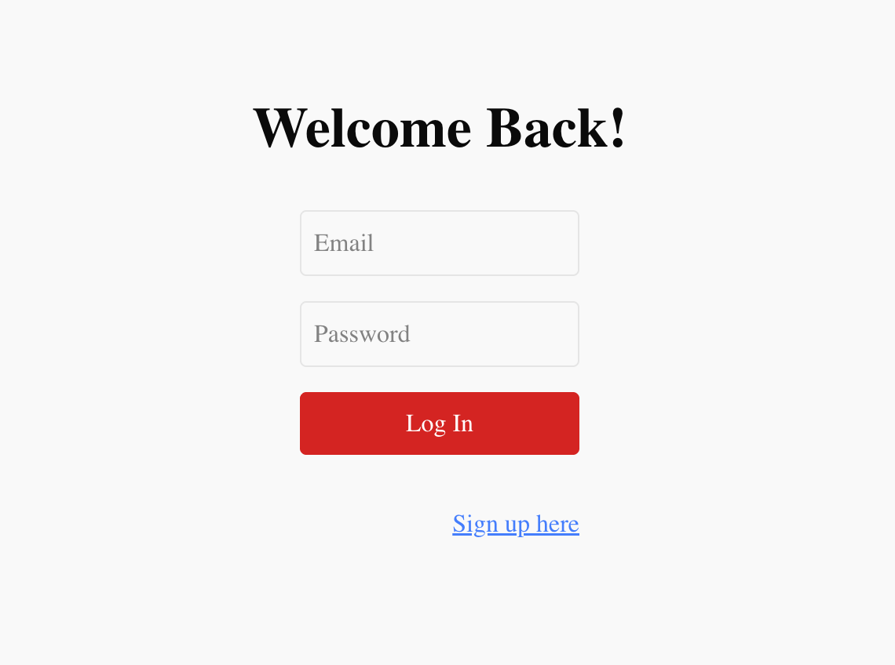
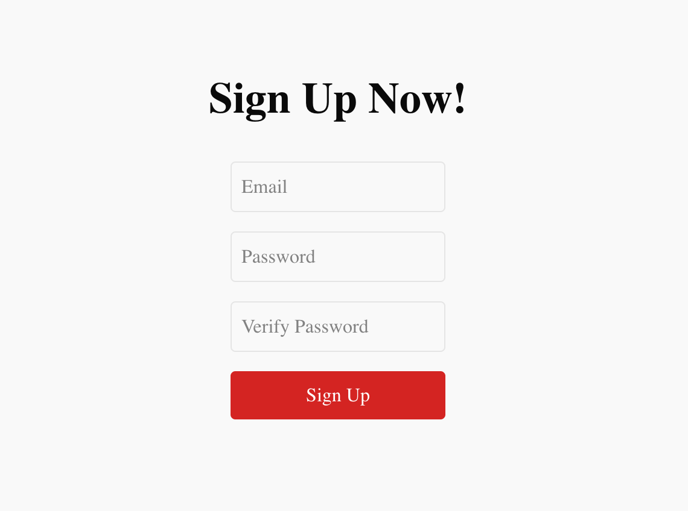
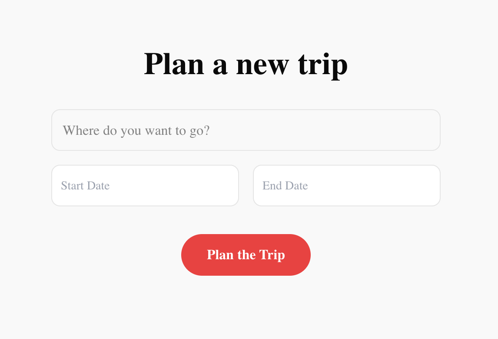
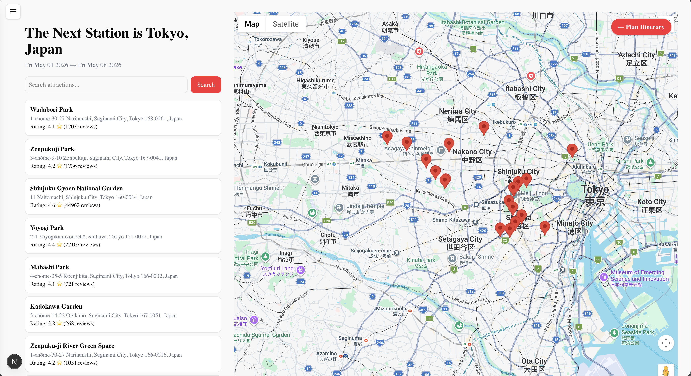
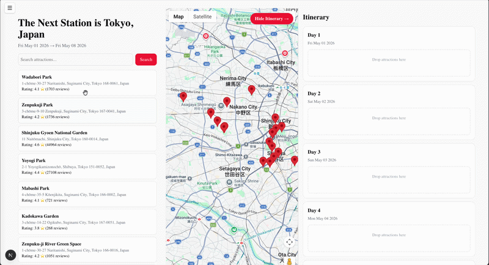
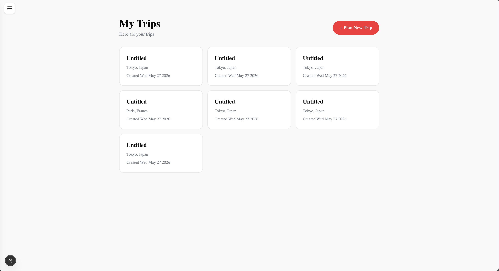
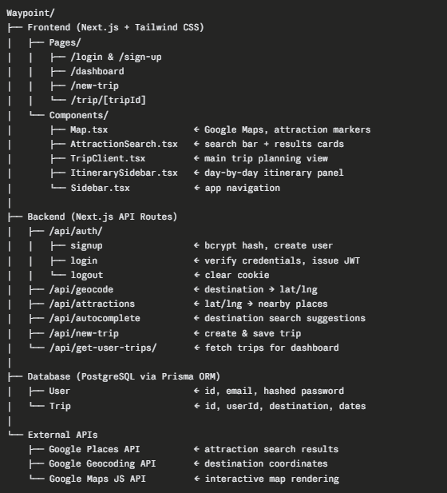

# Waypoint — Intelligent Trip Planning Platform

**Team Name:** Waypoint Wizards
**Team Members:** Li Junyu & Alpha Hong (Team 6761)
**Proposed Level of Achievement:** Apollo

**[Live Demo] (https://waypoint-wizards.vercel.app)**

## Motivation

Planning a trip is a complex and time-consuming process. Travelers often need to search across multiple platforms to gather information about attractions, routes, accommodation, weather, and activities. Even after collecting this information, organizing it into a practical day-by-day itinerary requires significant effort.

Existing travel planning tools either focus on specific aspects of travel (such as booking flights or accommodations) or require users to manually construct their itineraries. This fragmented experience makes trip planning inefficient and difficult to manage, particularly for group travel where coordination between multiple people is required.

We are motivated to build a centralized trip planning platform that simplifies this process by automatically organizing travel information and assisting users in generating optimized itineraries. By combining location data, routing information, and personalized preferences, our system aims to help travelers plan trips more efficiently while reducing manual effort.

## Aim

Waypoint is an intelligent trip planning platform that allows users to easily create, manage, and optimize travel itineraries. The system assists users in discovering attractions, organizing daily travel schedules, and optimizing travel routes between locations. By integrating multiple data sources such as location services, weather forecasts, and routing information, the application provides users with a convenient and intelligent way to plan their trips.

The platform also supports collaborative planning so that multiple users can coordinate and contribute to the same itinerary.

## User Stories

1. As a traveler who wants to plan a trip, I want to be able to search for attractions in a destination so that I can build an itinerary for my trip.
2. As someone who dislikes planning, I want the system to automatically generate a suggested itinerary so that I do not need to manually organize all activities.
3. As a traveler planning a group trip, I want to collaborate with my friends on the same itinerary so that everyone can contribute ideas.
4. As a traveler unfamiliar with the city, I want to be able to interact with maps and plan optimised routes between attractions to minimise travel time.
5. As a planner, I want to be able to plan accommodation and bookings on the app.
6. As a traveler, I want to track finances of the trip and record who paid for each expense (Splitwise-style).

## Features

### Core Features

**Feature 1: Intelligent Itinerary Generator**
The system generates a day-by-day itinerary based on user inputs such as destination, trip duration, interests, and preferred activity types. Attractions are selected and organized into a logical schedule.

**Feature 2: Map-Based Route Optimization**
The system calculates optimal routes between attractions using routing APIs to minimize travel time between activities within the same day.

**Feature 3: Attraction Discovery and Search**
Users can search for attractions, restaurants, and points of interest within a destination. Results include location information, ratings, and categories.

### Extension Features

**Feature 4: Collaborative Trip Planning**
Multiple users will be able to edit and contribute to the same itinerary. Users can add, remove, or rearrange activities while updates are synchronized across collaborators.

**Feature 5: Accommodation and Bookings**
The system will integrate third-party accommodation and event booking platforms into the trip planning workflow.

**Feature 6: Budget Estimation and Tracking**
The application will estimate approximate travel costs and feature a built-in shared ledger where trip expenses can be tracked and split between users (similar to Splitwise).

## Milestone 1 — Technical Proof of Concept

### What We Built

For Milestone 1, we have built an integrated frontend and backend that demonstrates the core system architecture with the following working features:

#### 1. User Authentication (Login / Sign Up)
- Users can register a new account and log in via **Supabase Auth** (email/password, session managed via Supabase's own HTTP-only cookies).
- Users can also **sign in with Google** (Supabase OAuth), added after the initial Supabase Auth migration. On a Google user's first sign-in, a matching `User` row is created automatically from their Google profile (name/avatar), with automatic de-duplication if the derived name is already taken.
- Session refresh happens in `src/proxy.ts` (Next.js's middleware/proxy convention), which also gates protected routes and redirects already-authenticated users away from `/login`/`/sign-up`.
- Backend API routes: `POST /api/auth/signup`, `POST /api/auth/login`, `POST /api/auth/logout`, `GET /auth/callback` (OAuth code exchange)
- Frontend pages: `/login`, `/sign-up`

> **Note:** this was originally a custom JWT (`jose`) + `bcrypt` system with tokens stored in a hand-rolled `httpOnly` cookie. It was fully migrated to Supabase Auth — the custom `src/lib/auth/tokens.ts` and `src/services/userServices.ts` modules (and their tests) were removed as part of that migration.

<table>
  <tr>
    <td></td>
    <td></td>
  </tr>
</table>

#### 2. Trip Creation
- Authenticated users can create a new trip by specifying a destination, start date, and end date.
- The trip is saved to the database and linked to the user's account.
- Users are redirected to the trip planning view upon creation.
- Backend API route: `POST /api/new-trip`
  

  

#### 3. Attraction Search with Google Places API
- Given a destination, the system geocodes the location and fetches nearby attractions using the Google Places Text Search API.
- Results display each attraction's name, rating, address, and total reviews.
- Backend API routes: `GET /api/geocode`, `GET /api/attractions`

#### 4. Interactive Map
- Attractions are displayed as markers on an interactive Google Map (`@vis.gl/react-google-maps`).
- Clicking a marker on the map scrolls to the corresponding attraction card in the list.
- Selecting an attraction card pans the map to its coordinates.

  

#### 5. Drag-and-Drop Itinerary Builder
- Users can drag attractions from the search results panel and drop them into a day-by-day itinerary sidebar.
- Within each day, attractions can be reordered via drag-and-drop using `@dnd-kit`.
- The itinerary sidebar supports multiple days based on the trip duration.

  

#### 6. User Dashboard
- Authenticated users have a dashboard displaying their saved trips.
- Backend API route: `GET /api/get-user-trips/[userId]`

  

### System Architecture

The application follows a layered architecture:

**Key design decisions:**
- Next.js App Router is used for both frontend pages and backend API routes, keeping the codebase unified.
- Prisma ORM abstracts the database layer, making it easy to switch databases if needed.
- Authentication is delegated to Supabase Auth (session cookie, refreshed via `src/proxy.ts`) rather than hand-rolled, freeing the app to focus on trip-planning logic.

### Tech Stack

| Layer | Technology |
|---|---|
| Frontend | Next.js 14, React, Tailwind CSS |
| Backend | Next.js API Routes (Node.js) |
| Database | PostgreSQL (via Prisma ORM) |
| Auth | Supabase Auth |
| Maps | Google Maps API (`@vis.gl/react-google-maps`) |
| Places | Google Places Text Search API |
| Drag & Drop | `@dnd-kit/core`, `@dnd-kit/sortable` |
| Deployment | Vercel |

### Software Engineering Practices

**Modular Architecture**
The codebase is organized by concern: API routes under `src/app/api/`, React components under `src/components/` (further split by feature: `login/`, `map/`, `trip/`, `itinerary/`, `sidebar/`), and pages under `src/app/`.

**Version Control**
We use Git for version control with our repository hosted on GitHub. Feature branches are used to isolate development work.

**Agile Development**
Development follows an iterative process with weekly goals aligned to milestone targets.

**Testing**
Unit and integration testing will be added progressively, with priority on API routes and core business logic.

## Milestone 2 — Prototype

### What We Built

#### 1. Persistent Itinerary Saving
- Users can save their drag-and-drop itinerary to the database at any time via the Save button.
- Saved itineraries are loaded back into the trip editor on each visit.
- Backend API route: `POST /api/itinerary/[itineraryId]/save`

#### 2. Social System (Follow / Unfollow)
- Users can search for other users by name and send follow requests.
- Follow requests must be accepted before a follow relationship is established.
- Users can view their followers and following lists, and unfollow at any time.
- Mutual friendship (bidirectional ACCEPTED follow) is used as a prerequisite for inviting collaborators.
- Backend API routes: `POST /api/users/[userId]/follow`, `POST /api/users/[userId]/follow-request`, `POST /api/users/[userId]/unfollow`, `GET /api/users/[userId]/get-followers`, `GET /api/users/[userId]/is-following`, `GET /api/users/search-user`, `GET /api/users/get-follow-requests`, `GET /api/users/[userId]/mutual-friends`

#### 3. Real-Time Collaborative Editing (LiveBlocks)
- Each itinerary is a LiveBlocks room identified by its `itineraryId`.
- Multiple collaborators can edit the same itinerary simultaneously with changes synced in real time (~100ms).
- Live cursor tracking shows each collaborator's cursor position and name on screen.
- The `liveblocks-auth` endpoint gates room access by checking the `Collaborator` table — only authorized users can connect.
- Itinerary data is stored as a `LiveMap<day, LiveList<LiveObject<AttractionEntry>>>` in LiveBlocks storage.
- Backend API route: `POST /api/liveblocks-auth`

#### 4. Collaborator Management
- The itinerary owner can invite mutual friends as collaborators via the Collaborator Panel.
- Invitees must have a bidirectional ACCEPTED follow relationship with the owner.
- The owner can also remove collaborators (cannot remove themselves as OWNER).
- Optimistic UI updates the collaborator list immediately on invite/remove.
- Backend API route: `POST /api/itinerary/[itineraryId]/collaborators`, `DELETE /api/itinerary/[itineraryId]/collaborators`

#### 5. Profile Management with Photo Upload
- Users can update their name, email, and profile picture from the Account page.
- Profile pictures are uploaded server-side to Supabase Storage using the service role key (bypasses Supabase RLS — see Architecture Notes below).
- Backend API route: `POST /api/upload-avatar`

#### 6. Route Directions & Trip Details Panel
- After adding attractions to a day, the app automatically fetches walking, driving, and transit routes between them via the Google Routes API.
- Routes for all days are fetched in parallel and displayed as coloured polylines on the map.
- Transit routes render each segment in the transit line's actual colour, with walking segments shown as dashed grey lines.
- A Trip Details Panel shows per-leg travel time and distance for the selected day and transport mode.
- Backend API route: `POST /api/directions`

#### 7. User Profiles
- Public profile pages at `/users/[id]` show a user's name, avatar, and follow status.

#### 8. Itinerary Rename
- Trip owners can rename their itinerary.
- Backend API route: `PATCH /api/itinerary/[itineraryId]/rename`

### Updated Tech Stack

| Layer | Technology |
|---|---|
| Frontend | Next.js 16, React 19, Tailwind CSS, shadcn/ui |
| Backend | Next.js API Routes (Node.js) |
| Database | PostgreSQL on Neon (via Prisma ORM) |
| Auth | Supabase Auth (email/password + Google OAuth) |
| Real-Time | LiveBlocks (collaborative storage + presence/cursors) |
| File Storage | Supabase Storage |
| Maps | Google Maps API (`@vis.gl/react-google-maps`) |
| Directions | Google Routes API (walking, driving, transit) |
| Places | Google Places Text Search API |
| Drag & Drop | `@dnd-kit/core`, `@dnd-kit/sortable` |

### Architecture Notes

**LiveBlocks collaboration**: The itinerary editor is split into a `TripClient` shell (renders `RoomProvider`, seeds `initialStorage` from the database on first visit) and a `TripInner` component (all live hooks: `useStorage`, `useMutation`, `useMyPresence`, `useOthers`). LiveBlocks becomes the source of truth for itinerary state after the first visit; the Save button syncs it back to the database.

**File upload pattern**: Profile pictures (and trip/post photos, added in Milestone 3) are routed through Next.js server routes (`/api/upload-avatar`, `/api/itinerary/[itineraryId]/trip-photos`, `/api/posts/[postId]/photos`) which use the Supabase service role key to write directly to Storage, bypassing RLS. This predates the Supabase Auth migration — it was originally required because our custom JWT system couldn't satisfy Supabase RLS policies (which expect a Supabase Auth JWT). Now that auth *is* Supabase Auth, this pattern is kept for simplicity, though it's no longer strictly necessary. The service role key never reaches the client.

**Mutual friend gating**: Inviting a collaborator requires both `Follow(callerId → invitee, ACCEPTED)` and `Follow(invitee → callerId, ACCEPTED)` to exist in the database.

**Directions**: On every itinerary change, the app fetches walking, driving, and transit routes for each day in parallel from `/api/directions`. Transit routes are rendered as coloured polyline segments matching the transit line colour. Route details (duration, distance per leg) are shown in the `TripDetailsPanel`.

## Milestone 3 — Social Feed, Splitwise-Style Budgeting & Messaging

### What We Built

#### 1. Trip Photos & Social Feed
- Each trip has a **Photos** tab with two photo pools: **Group Photos** (shared, visible to every collaborator, uploaded by anyone on the trip) and **My Photos** (individual, attached to the uploader's own post for that trip).
- A trip can be explicitly **posted to socials** via a toggle button — posting/un-posting is non-destructive: un-posting just hides it from the feed and profiles, it doesn't delete anything, so re-posting later brings back all your photos. Trips can be posted with zero photos (a "no photos" placeholder renders instead of an empty grid).
- The **Feed** page (`/feed`) shows published posts from people you follow (mutual-follow not required — one-directional `ACCEPTED` follow is enough to see someone's feed posts, matching Instagram-style visibility), each rendered as a card with an Instagram-style photo **carousel** (swipe/arrow navigation, dot indicators) combining that post's individual + trip group photos.
- Posts can be **liked**, and your own profile page lets you **edit the caption** or **take a post down** (same non-destructive un-publish as the trip-side toggle) directly from the post card.
- Data model: `Post` (one per user per trip, `published` boolean), `Photo` (individual), `TripPhoto` (group, itinerary-scoped not post-scoped), `PostLike`.
- Backend API routes: `GET`/`POST /api/itinerary/[itineraryId]/trip-photos`, `DELETE /api/itinerary/[itineraryId]/trip-photos/[photoId]`, `GET`/`POST /api/itinerary/[itineraryId]/posts` (the publish/edit/draft-create upsert), `POST /api/posts/[postId]/photos`, `DELETE /api/posts/[postId]/photos/[photoId]`, `POST`/`DELETE /api/posts/[postId]/like`, `GET /api/feed`, `GET /api/users/[userId]/posts`
- Service layer: `src/services/feedServices.ts`

#### 2. Splitwise-Style Budget Tracking
- A **Budget** tab on the trip page lets any collaborator log an expense (description, amount, payer), split equally across all current collaborators.
- A **"Who Owes Who"** summary nets multiple expenses between the same pair of people down to a single balance, and lets each side mark their portion **settled** (with a confirm step) or **delete** an expense entirely (payer-only, also with a confirm step).
- Names resolve correctly even for someone who has since left the trip, since they're sourced from the expense records themselves (not just the current collaborator list).
- The balance-netting math lives in a standalone `src/lib/balances.ts` (extracted out of the `BudgetPanel` component specifically so it's unit-testable) after a real bug surfaced here: an earlier version joined two user IDs with `-` to build a lookup key and split on `-` to read it back — which corrupted both IDs, since UUIDs themselves contain hyphens. Fixed by using a `|` separator instead; the regression is now locked in by a test using real hyphenated UUID fixtures.
- Backend API routes: `GET`/`POST /api/itinerary/[itineraryId]/expenses`, `PATCH /api/expenses/[expenseId]/settle`, `DELETE /api/expenses/[expenseId]`

#### 3. Direct Messaging (Supabase Realtime)
- 1:1 conversations, gated to **mutual followers only** (matching this app's existing privacy model), started from a "Message" button on a user's profile.
- Messages appear **instantly** on both ends via **Supabase Realtime** (Postgres Changes on the `Message` table), not polling — since Prisma and the Supabase client both write to the same underlying Postgres database, an insert made through our normal Next.js API route still triggers the Realtime event the browser is subscribed to.
- Row Level Security was enabled on `Conversation`/`Message` specifically so Realtime only streams a user their *own* conversations — this required no dashboard clicking, since our Postgres role (`postgres`, which our Prisma connection uses) bypasses RLS, so it only gates the Realtime subscription path, not any of the app's own server-side queries.
- The conversation list shows the other participant, a preview of the last message, and an unread-count badge.
- Data model: `Conversation` (`userAId`/`userBId` canonically sorted so `@@unique` catches both call orderings, regardless of who started the conversation), `Message` (with `readAt` for unread tracking).
- Backend API routes: `GET`/`POST /api/messages/conversations`, `GET`/`POST /api/messages/conversations/[conversationId]`
- Service layer: `src/services/messagingServices.ts`

#### 4. Social System Enhancements
- **Unfollow / cancel request from the UI**: clicking "Requested" cancels your own pending follow request immediately; clicking "Following" now opens a confirm modal before unfollowing.
- **Followers/following modal**: clicking the follower/following counts on a profile opens a searchable popup list, each row clickable through to that person's profile.
- Redesigned the follow-requests inbox badge (bell icon, proper count pill capped at "9+"), and added a clear button + Esc-to-clear on the user search bar.

#### 5. Mobile Responsiveness
- The trip page's 3-column desktop layout (Explore/Details/Budget/Photos panel, map, itinerary sidebar) collapses to a single-pane-at-a-time view below the `md` breakpoint, switched via a bottom tab bar, since a 3-column layout has no room on a phone screen.
- Since drag-and-drop from the attractions list onto a day only works when both are visible side-by-side (true on desktop, not on a single-pane mobile layout), added a tap-to-add alternative: a small "+" button per attraction opens a day picker, with a brief inline confirmation once added.
- Photo uploads (trip and post photos) support **camera capture** on mobile (`<input capture="environment">`), opening the phone's camera directly rather than only the gallery picker.
- Fixed a recurring layout bug along the way: several pages nested inside the shared `(sidebar)/layout.tsx` shell (which reserves padding and clips overflow) were using a hardcoded `h-screen`/`min-h-screen` instead of `h-full`, causing them to be taller than the space actually available and silently clip content at the bottom — regardless of scroll position. Fixed across the trip page, dashboard, feed, socials, profile, and account pages.

#### 6. Editable Trip Title
- Trip title is now editable inline from the trip page itself (next to the collaborators bar), not just from the dashboard's trip list — both use the same `PATCH /api/itinerary/[itineraryId]/rename` endpoint.

### Updated Tech Stack

| Layer | Technology |
|---|---|
| Auth | Supabase Auth (email/password + Google OAuth), session refresh via `src/proxy.ts` |
| Realtime Messaging | Supabase Realtime (Postgres Changes), gated by Row Level Security |
| File Storage | Supabase Storage (trip photos, post photos, avatars) |
| Everything from Milestone 1 & 2 | (Next.js, Prisma/Neon Postgres, LiveBlocks, Google Maps/Places/Routes, `@dnd-kit`) unchanged |

### Architecture Notes

**Publish, not delete**: un-posting a trip from socials, and taking down a post from your profile, both just flip `Post.published` to `false` rather than deleting anything — your photos and caption survive, and re-posting brings them straight back.

**Realtime + RLS, without touching the app's own auth model**: Supabase Realtime's Postgres Changes respects Row Level Security for the *subscribing* client's session, but our Next.js server always connects to Postgres as a role that bypasses RLS. This meant enabling RLS purely for messaging didn't require any changes to how every other route in the app already queries the database.

**Canonical ID ordering**: `Conversation` has no natural "owner" the way a `Post` does — either participant can start it. `userAId`/`userBId` are sorted lexicographically before every read/write, so `getOrCreateConversation("a","b")` and `getOrCreateConversation("b","a")` always resolve to the same row via `@@unique([userAId, userBId])`.

## Testing

### Tools

| Type | Tool | Purpose |
|---|---|---|
| Unit & Integration | Jest + ts-jest | Test pure functions, service-layer logic, and API route handlers |
| System (E2E) | Playwright | Automate a real browser to test full user flows (configured; flows below are the target, not yet all automated) |

Note: unit and integration tests both run under Jest's `node` environment, mocking `@/lib/prisma` / `@/lib/auth/session` / the relevant service module directly rather than hitting a real database — there is no separate test database. Component-level rendering tests (e.g. React Testing Library) aren't set up yet; that would need a jsdom environment added alongside the current node one.

As of Milestone 3: **22 test suites, 125 tests**, all passing (`npx jest`).

---

### Unit Tests

Unit tests cover pure functions and service-layer logic with Prisma (and, where relevant, other services) mocked out entirely, so they run instantly with no real database or network calls.

**`src/services/feedServices.ts` — Feed & Profile Posts**

| Test | What to verify |
|---|---|
| `getUserPosts` only returns published posts | Query includes `published: true` for the given owner |
| `getUserPosts` includes owner, photos, likes, and trip itinerary (with trip photos) | `include` shape matches what `PostCard` needs |
| `getFeedPosts` scopes to people the caller follows | `ownerId` filter is built from `Follow` rows where `followerId` = caller and `status: "ACCEPTED"` |
| `getFeedPosts` caps results at 20, newest first | `take: 20`, `orderBy: { createdAt: "desc" }` |

**`src/services/messagingServices.ts` — Direct Messaging**

| Test | What to verify |
|---|---|
| `areMutualFollowers` requires both directions ACCEPTED | Only true if `getFollowStatus` returns `"ACCEPTED"` both ways |
| `getOrCreateConversation` rejects messaging yourself | Throws before ever touching the database |
| `getOrCreateConversation` rejects non-mutual-followers | Throws `"You can only message mutual followers"` |
| `getOrCreateConversation` canonically sorts participant IDs | Calling it as A→B or B→A upserts the same `{userAId, userBId}` pair |
| `isParticipant` | True only when the given user is `userAId` or `userBId` on that conversation |
| `listConversations` resolves `otherUser` correctly | Returns whichever side the caller is *not* on |
| `listConversations` unread count | Counts only messages where `senderId` is not the caller and `readAt` is null |
| `getMessages` marks the other party's messages read | `updateMany` scoped to `senderId: { not: callerId }, readAt: null` |
| `sendMessage` creates the message and bumps `conversation.updatedAt` in one transaction | Both operations passed to a single `prisma.$transaction([...])` call |

**`src/lib/balances.ts` — Splitwise-Style Balance Calculation**

| Test | What to verify |
|---|---|
| Simple two-person debt | One expense, one owed amount |
| Full UUIDs preserved in the result | Regression test for a bug where joining two hyphenated UUIDs with `-` and splitting on `-` corrupted both IDs |
| Multiple expenses between the same pair net to one balance | Two opposing expenses collapse into a single net amount |
| A pair whose net balance rounds to zero is excluded | Equal-and-opposite expenses produce no balance entry |
| Already-settled splits are excluded | A `settled: true` split contributes nothing |
| The payer's own split on their own expense is excluded | Payer never "owes" themselves |
| Multi-way debts between three people are computed independently | Each pair's balance is correct in isolation |

**`src/services/socialsServices.ts` — Follow Logic**

| Test | What to verify |
|---|---|
| `followUser` creates a PENDING follow record | Returns a Follow object with `status: "PENDING"` |
| `unfollowUser` removes the follow record | Subsequent `getFollowStatus` returns `"NONE"` |
| `getFollowStatus` returns `"NONE"` when no record exists | No follow between two users returns `"NONE"` |
| `getFollowStatus` returns `"PENDING"` for a pending request | Returns `"PENDING"` before acceptance |
| `getFollowStatus` returns `"ACCEPTED"` after acceptance | Returns `"ACCEPTED"` once the follow is updated |
| `respondToFollowRequest` with `"ACCEPT"` updates status | Follow record status becomes `"ACCEPTED"` |
| `respondToFollowRequest` with `"REJECT"` deletes the record | Follow record is removed entirely |
| `getFollowers` only returns ACCEPTED follows | PENDING followers are excluded from results |
| `getFollowers` includes `followBackStatus` for each follower | Each returned user has a `followBackStatus` field |
| `searchUsers` returns matching users case-insensitively | Searching `"alice"` matches a user named `"Alice"` |
| `searchUsers` includes `followStatus` for each result | Each returned user has a `followStatus` field |
| `getNumFollowers` counts only ACCEPTED follows | PENDING follows are not counted |
| `getNumFollowing` counts only ACCEPTED follows | PENDING follows are not counted |

**`src/services/tripServices.ts` — Itinerary Creation**

| Test | What to verify |
|---|---|
| `createItinerary` creates the itinerary with correct fields | Title, location, startDate, endDate match input |
| `createItinerary` creates a Collaborator row with role OWNER | Returned `collaborators` array contains one entry with `role: "OWNER"` and the correct `userId` |
| `createItinerary` links the owner to the itinerary | The Collaborator record's `itineraryId` matches the created itinerary's `id` |

**`src/components/trip/TripClient.tsx` — `sortAttractions`**

| Test | What to verify |
|---|---|
| Higher-rated attraction with more reviews ranks first | A 4.8★ / 10,000 reviews attraction ranks above a 3.5★ / 100 reviews attraction |
| Same rating, more reviews ranks higher | Two 4.5★ attractions — the one with more reviews comes first |
| Same rating and same reviews preserves relative order | No crash, stable output |
| Single-element array returns unchanged | Input with one attraction returns that same attraction |
| Empty array returns empty array | No crash on empty input |

---

### Integration Tests

Integration tests call the actual API route handlers (`GET`/`POST`/`DELETE` exports imported directly from each `route.ts`) with a real `NextRequest` and mock `params`, but with Prisma, `getCurrUserId`, and Supabase clients mocked — so they verify that auth checks, request/response shapes, and status codes all work together, without a real database or network call.

**`GET`/`POST /api/itinerary/[itineraryId]/trip-photos`, `DELETE .../trip-photos/[photoId]`**

| Test | Expected result |
|---|---|
| Unauthenticated request (GET or POST) | 401 |
| Non-collaborator requests GET or POST | 403 |
| Collaborator fetches the trip's photos | 200 with the photo list |
| POST with no file attached | 400 |
| POST when the Storage upload itself fails | 500 |
| POST on success | 201, `TripPhoto` created with the uploader's ID |
| DELETE on a photo that doesn't exist | 404 |
| DELETE by someone other than the uploader | 403, no delete call made |
| DELETE by the uploader | 200 |
| DELETE when Storage removal fails after the DB row is gone | 400 |

**`GET`/`POST /api/itinerary/[itineraryId]/posts`** (the publish/edit/draft-create upsert)

| Test | Expected result |
|---|---|
| Unauthenticated request | 401 |
| Non-collaborator POST | 403 |
| POST with no body | Upserts without touching `published` or `description` (draft-create only) |
| POST with `{ published: true }` | Sets `published` on both the `create` and `update` branches |
| POST with `{ description }` | Only sets `description`, leaves `published` untouched |

**`POST /api/posts/[postId]/photos`, `DELETE .../photos/[photoId]`**

| Test | Expected result |
|---|---|
| Unauthenticated request | 401 |
| Post doesn't exist | 404 |
| Caller is not the post's owner | 403, no upload/delete performed |
| No file attached (POST) | 400 |
| Owner uploads successfully | 201, `Photo` row created |
| Photo belongs to a different post than the URL says | 404 |
| Owner deletes successfully | 200 |

**`POST`/`DELETE /api/posts/[postId]/like`**

| Test | Expected result |
|---|---|
| Unauthenticated request | 401 |
| Like (upsert) | 201, idempotent `where`/`create`/`update` shape |
| Unlike when no like exists | 200, no-op (delete never called) |
| Unlike when a like exists | 200, deletes the `PostLike` row |

**`GET`/`POST /api/messages/conversations`, `GET`/`POST .../[conversationId]`**

| Test | Expected result |
|---|---|
| Unauthenticated request (any handler) | 401 |
| POST with no `otherUserId` | 400 |
| POST when the two users aren't mutual followers | 400 (service throws, route catches) |
| POST creates/fetches the conversation | 201 |
| GET/POST on a conversation the caller isn't part of | 403 |
| POST with empty/whitespace-only message content | 400 |
| POST sends the trimmed message | 201 |

**`DELETE /api/expenses/[expenseId]`**

| Test | Expected result |
|---|---|
| Unauthenticated request | 401 |
| Expense doesn't exist | 404 |
| Caller didn't pay for the expense | 403, no delete performed |
| Caller is the payer | 200, deleted |

**`POST /api/new-trip`**

| Test | Expected result |
|---|---|
| Unauthenticated request | 401 |
| End date before start date | 400, itinerary never created |
| End date equal to start date (single-day trip) | 201 (allowed) |
| Valid date range | 201, default title assigned |
| A user's Nth trip | Default title numbered (`"New Trip N"`) |

**`GET /auth/callback`** (OAuth code exchange)

| Test | Expected result |
|---|---|
| No `code` query param | Redirects to `/login` |
| Code exchange itself errors | Redirects to `/login` |
| OAuth user has no email | Redirects to `/login` instead of throwing — **regression test** for a real bug where a force-unwrapped `null` email reached a `NOT NULL` Postgres column |
| First-time sign-in | Redirects to `/dashboard`, creates a `User` row with name from `full_name`/`name` metadata (falling back to the email prefix) |
| Derived name already taken | Appends a numeric suffix (`"Alice"` → `"Alice1"`) |
| Returning user | Skips user creation entirely |

**`POST /api/itinerary/[itineraryId]/collaborators`**

| Test | Expected result |
|---|---|
| OWNER invites a mutual friend | 201, Collaborator row created in DB with role EDITOR |
| OWNER invites a non-mutual-friend | 403, `"Invitee is not a mutual friend"` |
| OWNER invites a user with only a one-sided follow | 403, mutual friend check fails |
| EDITOR tries to invite someone | 403, `"Only the OWNER can add collaborators"` |
| Unauthenticated request | 401 |
| Inviting an already-existing collaborator | 201, upsert no-ops without error |

**`DELETE /api/itinerary/[itineraryId]/collaborators`**

| Test | Expected result |
|---|---|
| OWNER removes an EDITOR | 200, Collaborator row deleted from DB |
| OWNER tries to remove themselves (OWNER role) | 400, `"Cannot remove the OWNER"` |
| EDITOR tries to remove someone | 403 |
| Removing a non-existent collaborator | 404 |
| Unauthenticated request | 401 |

**`GET /api/users/[userId]/mutual-friends`**

| Test | Expected result |
|---|---|
| Two users with bidirectional ACCEPTED follows | Both appear in each other's mutual friends list |
| One-sided follow (A→B only) | B does not appear in A's mutual friends |
| Both follows exist but one is PENDING | User not returned (must be ACCEPTED) |
| With `?itineraryId=` param | Users already in that itinerary's collaborators are excluded |
| Requesting as a different userId than the authenticated user | 403 |
| Unauthenticated request | 401 |

**`GET /api/feed`, `GET /api/users/[userId]/posts`, `GET /api/users/[userId]/get-following`**

Thin wrapper routes — a couple of tests each confirming the auth check (where present) and correct delegation to the already-tested service function.

---

### System Tests (End-to-End)

System tests automate a real browser using Playwright to verify complete user flows from the UI perspective.

**Flow 1: Authentication**
1. Navigate to `/sign-up`
2. Fill in name, email, and password, then submit
3. Assert redirect to `/dashboard`
4. Log out, navigate to `/login`, log in with the same credentials
5. Assert the dashboard is visible and the user's name appears in the sidebar

**Flow 2: Trip Creation and Itinerary Building**
1. Log in as a test user
2. Click "New Trip", fill in a destination, select start and end dates, then submit
3. Assert redirect to the trip page at `/trip/[id]`
4. Wait for attractions to load in the left panel
5. Drag an attraction card into Day 1 in the itinerary sidebar
6. Assert the attraction appears under Day 1
7. Click Save and assert the confirmation state

**Flow 3: Social Follow Flow**
1. Log in as User A, search for User B by name
2. Send a follow request to User B
3. Log in as User B, navigate to `/socials`
4. Accept the follow request from User A
5. User B sends a follow request back to User A
6. Log in as User A and accept it
7. Assert both users appear in each other's mutual friends list when opening the Collaborator Panel

**Flow 4: Collaborative Editing**
1. Log in as User A (trip owner), open a trip
2. Open the Collaborator Panel and invite User B (mutual friend)
3. In a second browser context, log in as User B and navigate to the same trip URL
4. User A drags an attraction into Day 1
5. Assert User B's itinerary updates without refreshing within 2 seconds
6. Assert User A's cursor label is visible in User B's view

---

### Running Tests

Unit and integration tests: `npx jest`

Unit tests in watch mode: `npx jest --watch`

System tests (requires dev server running on port 3000): `npx playwright test`

View Playwright HTML report after a run: `npx playwright show-report`

---

## Development Plan

### Milestone 3 (27 Jul – 26 Aug) — Extended System

- ~~Budget estimation and shared expense tracking~~ — done (Splitwise-style budgeting, see above)
- ~~Cloud deployment~~ — done, live at the demo link at the top of this doc
- ~~Improved UI/UX~~ — done for mobile (responsive trip page, tap-to-add, camera capture); general performance optimization still open
- Social feed, direct messaging, and further social features (unfollow UI, followers/following modal) were **not originally scoped for Milestone 3** but were built alongside it — see the Milestone 3 feature write-up above
- Weather-based itinerary adjustments — **not yet built**, carried forward

### Looking Ahead

- Weather-based itinerary adjustments (carried over from Milestone 3)
- Accommodation and event booking integration (original proposal Feature 5, not yet started)
- Component-level test coverage (React Testing Library + jsdom) and expanding the Playwright E2E suite beyond its current configured-but-mostly-unwritten state
- General performance optimization pass
